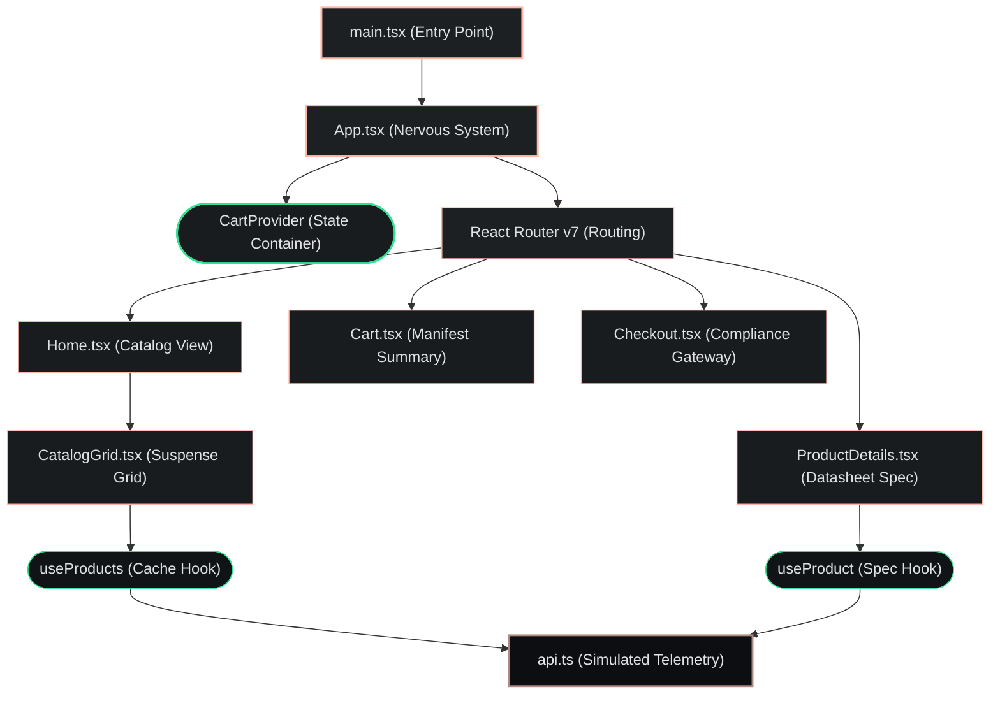

# AeroCore Systems - Propulsion E-Commerce
## Jules Learning Project - 001

Welcome to the **AeroCore Systems** codebase. This application is developed as an end-to-end demo showcase for **Jules**.

We intentionally added too many steps to the checkout process so we can give Jules some "real" product feedback and it can help smooth those papercuts.

Below is a blueprint of how this application is structured.

---

## High-Level Architecture

This application is structured as a modern React web application built on top of the following core technologies:
*   **Vite**: Provides high-performance module bundling and instant local development server.
*   **React 19**: Serves as the core structural foundation, using modern data loading patterns.
*   **React Router v7**: Governs application view routing and URL state management.
*   **Tailwind CSS v4**: Governs our design tokens, Material-inspired theming, and custom utility styles (such as the retro CRT scanline overlays).
*   **TypeScript**: Guarantees type safety across the inventory catalog, shopping carts, and system components.

### Styling Guidelines
*   **Tailwind CSS v4**: We use Tailwind for all component styling. Please avoid writing custom CSS in `src/index.css` unless creating global utilities or specific theme overrides.
*   **Material Symbols**: Icons are loaded via Material Symbols. Use the `<span className="material-symbols-outlined">icon_name</span>` pattern.

---

## System Architecture

The following Mermaid diagram details the operational data flow and component hierarchies across the **AeroCore Systems** e-commerce framework:




---

## Solid Architectural Base (vs. Deliberate Friction)

While browsing the catalog, you will notice a **high-quality, robust structural baseline**:
*   **Predictable State Management**: Extracted into [src/context/CartContext.tsx](./src/context/CartContext.tsx), delivering centralized state access for the shopping cart mutations, pallet gift checkboxes, and encrypted payment computations.
*   **React 19 Data Loading**: Modernized with the `use()` hook in [src/hooks/useFetchProducts.ts](./src/hooks/useFetchProducts.ts), fetching data asynchronously and tying into `React.Suspense` and [src/components/ErrorBoundary.tsx](./src/components/ErrorBoundary.tsx) for robust fault containment.
*   **Isolated API Services**: Inventory manifest querying logic lives securely inside [src/services/api.ts](./src/services/api.ts) to separate concerns and streamline future backend telemetry implementations.
*   **Intentional Friction**: In contrast to this solid architecture, the **checkout UX is deliberately designed with an excessive amount of steps**. Rather than providing a generic one-click checkout, the application obligates the user to verify regional delivery availability via ZIP code, describe their intended mechanical usage, acknowledge explicit hazardous terms, accept shipping protection, and input precise details. This friction exists to mirror sophisticated compliance-heavy logistics pipelines.

---

## File & Folder Blueprint

| Directory / File | Purpose | Role in the Application |
| :--- | :--- | :--- |
| [src/App.tsx](./src/App.tsx) | Nervous System | Orchestrates global layout, view routing, and React Suspense bindings. |
| [src/main.tsx](./src/main.tsx) | Application Entry Point | Bootstraps the React application. |
| [src/index.css](./src/index.css) | Styling System | Houses Tailwind CSS v4 custom design tokens and retro `.scanline-overlay` filters. |
| [src/types.ts](./src/types.ts) | Type System | Declares TypeScript interfaces for products, cart items, and the static inventory database. |
| [src/components/](./src/components) | Presentation Components | Contains focused UI components like `Footer`, `Navigation`, `ProductCard`, `CatalogGrid`, and loading states. |
| [src/context/](./src/context) | State Container | Manages shopping cart state through a highly predictable React Context provider. |
| [src/hooks/](./src/hooks) | Data Fetching Hooks | Implements React 19 cache patterns for deep space manifest telemetry loading. |
| [src/pages/](./src/pages) | Feature Views | Holds e-commerce manifests: `Home`, `ProductDetails`, `Cart`, and compliance-rich `Checkout`. |
| [src/services/](./src/services) | Operations Services | Isolates simulated API interactions from UI presentation layers. |

### Blueprint Details

#### Core & Configuration
*   [src/main.tsx](./src/main.tsx): The absolute starting entry point for the React application.
*   [src/App.tsx](./src/App.tsx): The routing center of the web application. Handles lazy routing through React Router.
*   [src/types.ts](./src/types.ts): Houses data declarations like `Product` and `CartItem`. Maintains our mock inventory manifest.
*   [src/index.css](./src/index.css): Encapsulates Material-inspired theme configurations and retro CRT UI utilities.

#### Pages Folder ([src/pages/](./src/pages))
*   [src/pages/Home.tsx](./src/pages/Home.tsx): The main catalog view featuring mission updates and hero sections.
*   [src/pages/ProductDetails.tsx](./src/pages/ProductDetails.tsx): A detailed datasheet manifest equipped with ZIP checkers and usage disclaimers.
*   [src/pages/Cart.tsx](./src/pages/Cart.tsx): A shopping manifest incorporating countdown scarcity timers, shipping insurance options, and pallet configurations.
*   [src/pages/Checkout.tsx](./src/pages/Checkout.tsx): A compliance-driven checkout module sequentially split into Customer Information, Shipping, Payments, and Liability Checks.
*   [src/pages/Profile.tsx](./src/pages/Profile.tsx): Profile dashboard (Under Construction).
*   [src/pages/Search.tsx](./src/pages/Search.tsx): Search and discovery module (Under Construction).

#### Components Folder ([src/components/](./src/components))
*   [src/components/Navigation.tsx](./src/components/Navigation.tsx): Nav bar featuring brand identifiers, navigational links, and dynamic cart badges.
*   [src/components/CatalogGrid.tsx](./src/components/CatalogGrid.tsx): Renders the inventory catalog grid and orchestrates product loading.
*   [src/components/ProductCard.tsx](./src/components/ProductCard.tsx): Displays technical product summaries, pricing, and specifications.
*   [src/components/SkeletonCard.tsx](./src/components/SkeletonCard.tsx): Delivers smooth `animate-pulse` loaders during Suspense fallback cycles.
*   [src/components/ErrorBoundary.tsx](./src/components/ErrorBoundary.tsx): Implements fault containment across isolated sections of the DOM.
*   [src/components/Footer.tsx](./src/components/Footer.tsx): Displays system metadata and aerospace legal disclaimers.

#### Extracted Core Folders
*   [src/context/CartContext.tsx](./src/context/CartContext.tsx): Centralized shopping cart dispatcher.
*   [src/hooks/useFetchProducts.ts](./src/hooks/useFetchProducts.ts): Custom caching telemetry hooks utilizing React 19 data resolution.
*   [src/services/api.ts](./src/services/api.ts): Abstracted simulated API operations serving orbital inventories.

---

## Getting Started

### Prerequisites
*   **Node.js** (v18 or higher recommended)

### Run Locally
1.  Install application dependencies:
    ```bash
    npm install
    ```
2.  Kickstart the local development server:
    ```bash
    npm run dev
    ```
3.  Access the application locally at: [http://localhost:3000](http://localhost:3000)

